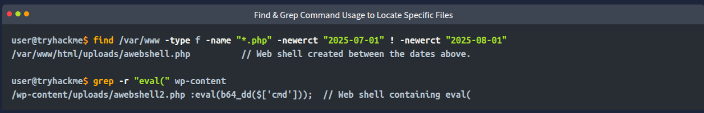
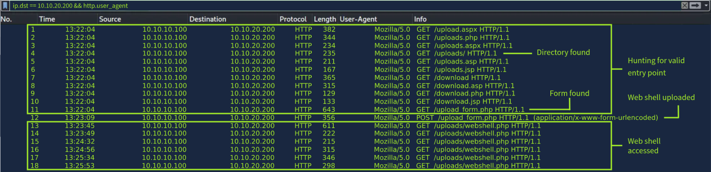
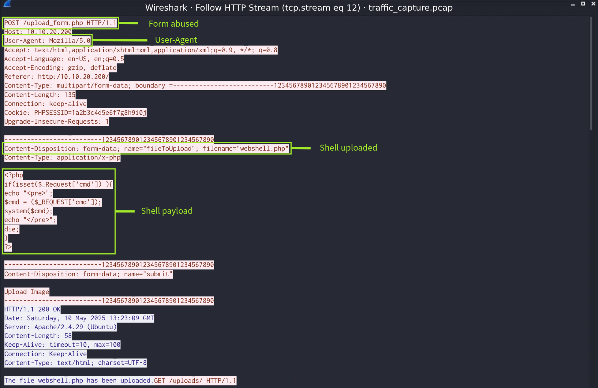

# Common Client-Side Attacks

- [**Cross-Site Scripting**](https://tryhackme.com/room/axss) (XSS) is the [most common(opens in new tab)](https://www.hackerone.com/blog/how-cross-site-scripting-vulnerability-led-account-takeover) client-side attack, in which malicious scripts are run in a trusted website and executed in the user's browser. If your website has a comment box that doesn't filter input, an attacker could post a comment like: `Hello `. When visitors load the page, the script runs inside their browser, and the pop-up appears. In a real attack, instead of a harmless pop-up, the attacker could steal cookies or session data.
- [**Cross-Site Request Forgery**](https://tryhackme.com/room/csrfV2) (CSRF): The browser is tricked into sending unauthorized requests on behalf of the trusted user.
- **Clickjacking**: Attackers overlay invisible elements on top of legitimate content, making users believe they are interacting with something safe.

# Server-Side Attacks

- [**Brute-force**](https://tryhackme.com/room/passwordattacks) attacks occur when an attacker repeatedly attempts different usernames or passwords in an attempt to gain unauthorized access to an account. Automated tools are often used to send these requests quickly, allowing attackers to go through large lists of credentials and common passwords. [T-Mobile(opens in new tab)](https://www.fierce-network.com/operators/t-mobile-ceo-says-hacker-used-brute-force-attacks-to-breach-it-servers) faced a breach in 2021 that stemmed from a brute-force attack, allowing attackers access to the personally identifiable information (PII) of over 50 million T-Mobile customers.
- [**SQL Injection**](https://tryhackme.com/room/sqlinjectionlm) (SQLi) relies on attacking the database that sits behind a website and occurs when applications build queries through string concatenation instead of using parameterized queries, allowing attackers to alter the intended SQL command and access or manipulate data. In 2023, an SQLi vulnerability in [MOVEit(opens in new tab)](https://www.akamai.com/blog/security-research/moveit-sqli-zero-day-exploit-clop-ransomware), a file-transfer software, was exploited, affecting over 2,700 organizations, including U.S. government agencies, the BBC, and British Airways.
- [**Command Injection**](https://tryhackme.com/room/oscommandinjection) is a [common attack(opens in new tab)](https://krishnag.ceo/blog/the-2024-cwe-top-25-understanding-and-mitigating-cwe-78-os-command-injection/) that occurs when a website takes user input and passes it to the system without checking it. Attackers can sneak in commands, making the server run them with the same permissions as the application.

# Log-based Detection

# Beyond Logs

## File System Analysis

Here are some common web server directories where web shells are typically placed:

- Apache: `/var/www/html/` Default on most Linux distros
- Nginx: `/usr/share/nginx/html/` Default on many Linux setups

Even if a custom root path is configured, attackers can guess or scan for common upload directories, like `/uploads/`, `/images/`, or `/admin/`.

Temporary directories like `/tmp` can also be abused if file permissions are not configured securely.

**Suspicious or Random File Names**

- Monitor files with executable extensions like `.php` & `.jsp`
- Be on the lookout for double extensions to disguise malicious files `image.jpg.php`

**Helpful Commands**

****

## Network Traffic Analysis

Many of the indicators that analysts need to be on the lookout for in log analysis can be applied to network traffic analysis as well.

- Unusual HTTP Methods & Request Patterns
- Suspicious User-Agents & IP Addresses
- Encoded Payloads
- Malicious Code or Commands in Request Bodies
- Unexpected Protocols or Ports
- Unexpected Resource Usage
- Web Server Processes Spawning Command Line Tools

Some useful Wireshark http filters.

- `http.request.method == “METHOD”`  
    Hunting for repeated or unusual requests can be useful
- `http.request.uri contains “.php”`  
    Can be helpful in finding suspicious or modified files
- `http.user_agent`  
    Used to locate unusual or outdated User-Agents

&nbsp;