**Denial-of-Service (DoS)** attacks can take many forms, but their ultimate aim is to disrupt or completely block access to a website or web service.

## Distributed Denial-of-Service (DDoS)

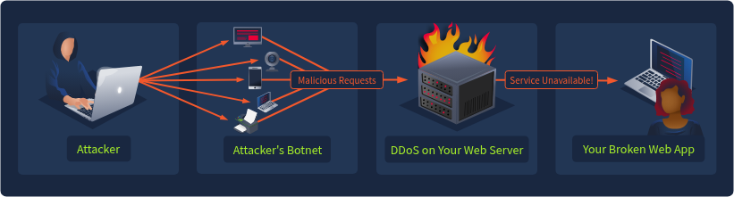

- The limitation of a basic DoS attack is that it relies on a single machine and a single internet connection.
- To scale up, attackers turn to **Distributed Denial-of-Service (DDoS)** attacks and utilize botnets, an army of compromised devices under their control.
- An attacker instructs their botnet to swarm your site, and the sudden influx of traffic quickly exhausts your resources, bringing the website down.

## Types of Denial-of-Service Attacks

| DoS Attack Type | Description |
| --- | --- |
| Slowloris | Sending many partial HTTP requests to tie up server resources |
| HTTP Flood | Sending a large number of HTTP requests to overwhelm the server |
| Cache Bypass | Bypassing CDN edge servers and forcing the origin server to respond |
| Oversized Query | Forcing the server to process large, resource-intensive requests |
| Login/Form Abuse | Overloading authentication logic with login attempts or password resets |
| Faulty Input Validation Abuse | Exploiting poorly designed input handling |

# Attack Motives

| Motive | Description | Example Scenario |
| --- | --- | --- |
| [Financial Loss(opens in new tab)](https://www.curotec.com/insights/christmas-hackers-attacks-increase-around-holidays/) | Disrupt services to stop or reduce sales and revenue | Flooding an e-commerce website during peak holiday sales |
| [Extortion(opens in new tab)](https://www.cloudflare.com/learning/ddos/ransom-ddos-attack/) | Demand payment to stop a current attack | Threatening a bank with a ransom DDoS |
| [Hacktivism(opens in new tab)](https://www.zayo.com/resources/how-governments-can-combat-ddos-risk-during-elections/) | Disruption for social or political protest | Attacking government websites during election season |
| [Distraction(opens in new tab)](https://www.cyberdefensemagazine.com/ddos-as-a-distraction/) | Redirect defenders' attention while other attacks take place | Launching a DDoS while attacking other infrastructure |
| [Competition(opens in new tab)](https://digitalmarketingdesk.co.uk/63-of-ddos-attacks-linked-to-competitors/) | Disrupt a rival's service to drive up their costs or gain market share | A competitor launches a DDoS during a product launch |
| [Denial of Wallet(opens in new tab)](https://blog.limbus-medtec.com/the-aws-s3-denial-of-wallet-amplification-attack-bc5a97cc041d) | Force the victim to rack up service usage costs | Attackers repeatedly access AWS S3 data, generating costs per request |
| [Reputational Damage(opens in new tab)](https://stormwall.network/resources/blog/how-ddos-attacks-are-hurting-esports) | Cause customers to lose trust in a company | Game servers crashing during launch day |

# Log Analysis

| Indicator | Example | Description |
| --- | --- | --- |
| High Request Rate | `10.10.10.100` → 1000 `GET /login` | A resource-heavy page like `/login` is flooded with requests to overwhelm authentication processes. Login pages are common targets since each request may trigger password checks and database queries |
| Odd User-Agents | `curl/7.6.88` → `/index` repeatedly | Attackers spoof outdated or unusual User-Agents to blend in or bypass filters. Spotting traffic with tools like `curl` or `Python-urllib/3.x`, for example, can be a red flag for automated attacks |
| Geographic Anomalies | IP address origins dotted around the world | Legitimate traffic typically comes from a few regions where real users are located. A globally distributed botnet may utilize IP addresses from around the world |
| Burst Timestamps | 50 requests in 1 second → `/search` | A sudden spike of requests packed into the same second creates an unnatural traffic pattern that points to automation |
| Server Errors ([5xx(opens in new tab)](https://developer.mozilla.org/en-US/docs/Web/HTTP/Reference/Status#server_error_responses)) | A significant spike of `503 Service Unavailable` errors | A sudden surge of server error responses (`500` - `511`) indicates resources are maxed out and the service is struggling under attack traffic |
| Logic Abuse | `GET /products?limit=999999` | Attackers craft queries that overload the server, forcing it to load huge amounts of information and slowing it down for everyone |

## Targeted Resources

Pages like `/login` or search forms are prime targets because each request forces the server to query a database, validate input, and return results.

Commonly targeted endpoints and reasoning:

- `/login` - involves authentication processes
- `/search` - requires complex database queries
- `/api` endpoints - critical for dynamic content delivery
- `/register` or `/signup` - requires database writes and validation
- `/contact` or `/feedback` - requires database entries and can trigger email notifications
- `/cart` or `/checkout` - requires session management, inventory checks, and payment processing

## Log Sample

1.  **Normal User Traffic** - Every few seconds, a user requests a page and receives a response as expected
2.  **DoS Attack** - Beginning at `10:01:10`, you can see the IP address `203.0.113.55` begin to send repeated `GET` requests to `/login.php`
3.  **Web Server Down** - Users are requesting pages and receiving `503` responses indicating the service is unavailable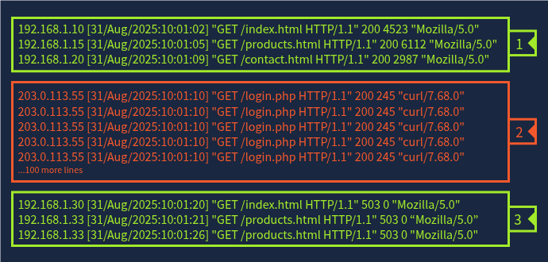

&nbsp;

# Leveraging SIEMs

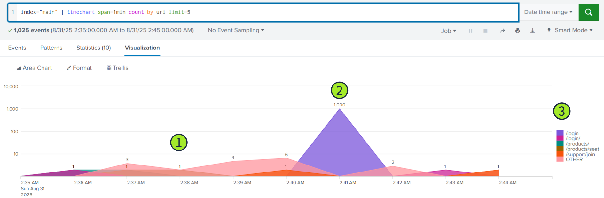

1.  **Normal User Requests** - A few requests to various pages every minute
2.  **DoS Attack** - 1,000 requests to `/login.php` within a one-minute timeframe
3.  **Requested Pages**

Looking over the same requests but filtering by the user agent (`useragent`) and IP address (`clientip`) fields enables you to see more details about where the requests originated.

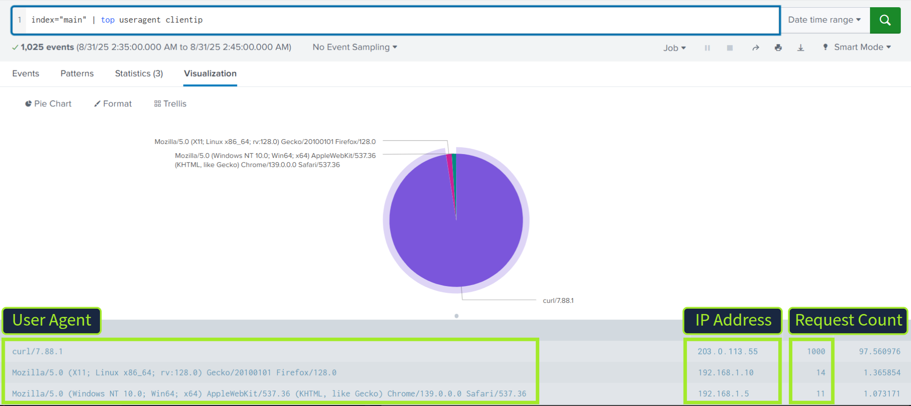

## Hands On

What was the most frequently requested `uri`?

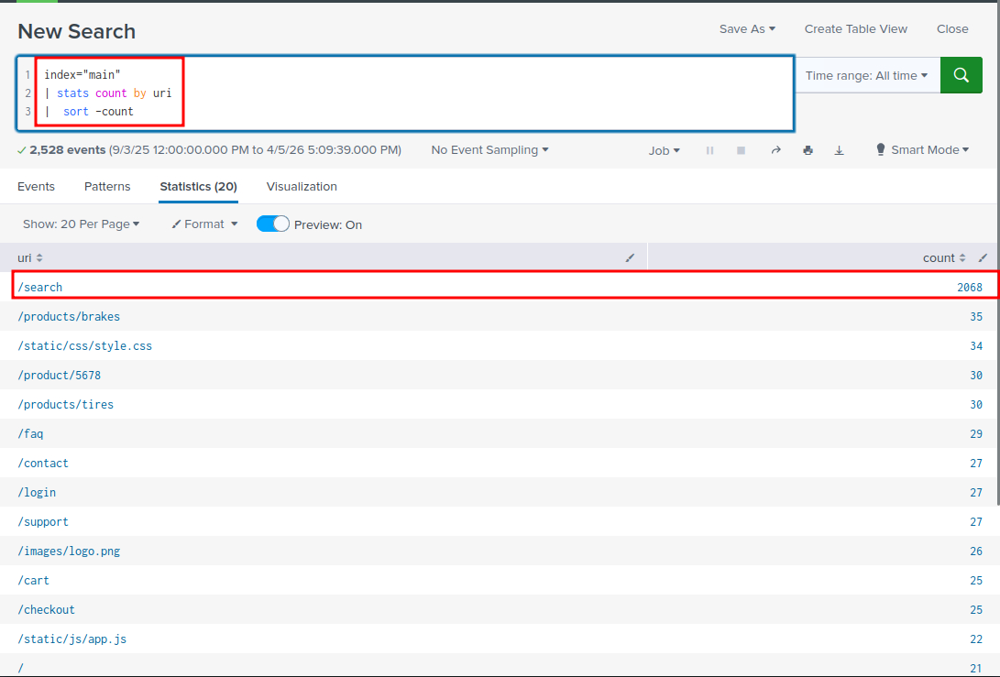

Which `clientip` made the most requests to the target `uri`?

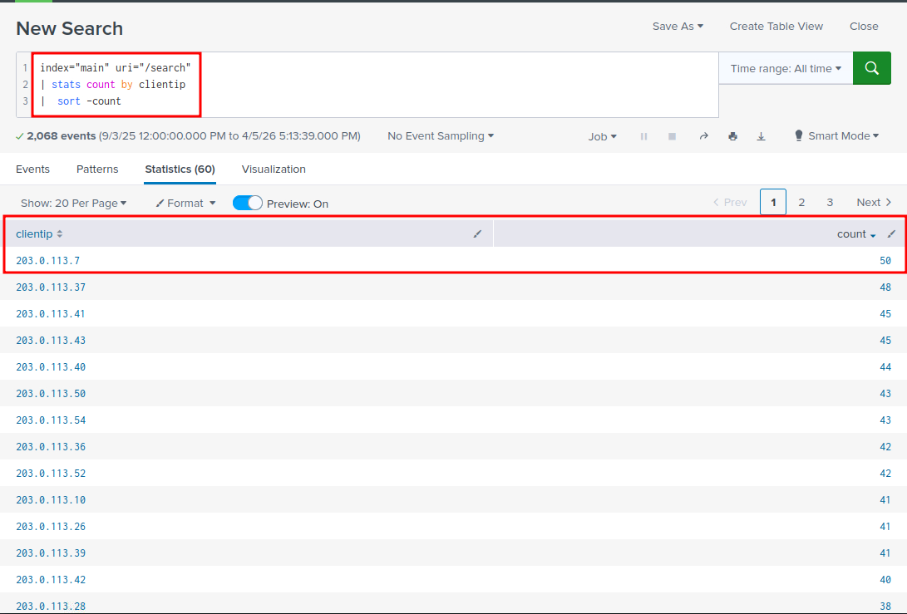

Which `useragent` was most commonly used by the attacking traffic?

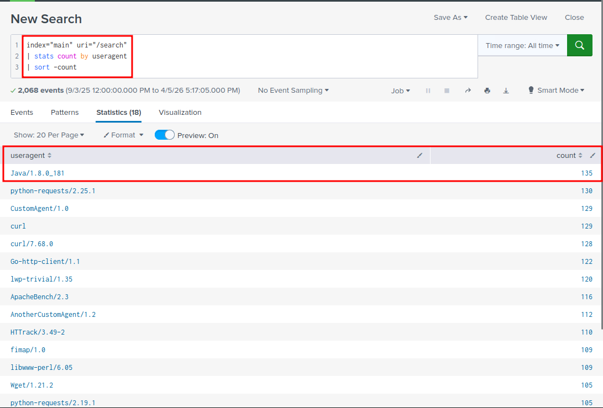

Use the `timechart` command to visualize the requests.  
What is the peak number of requests made per second during the attack?

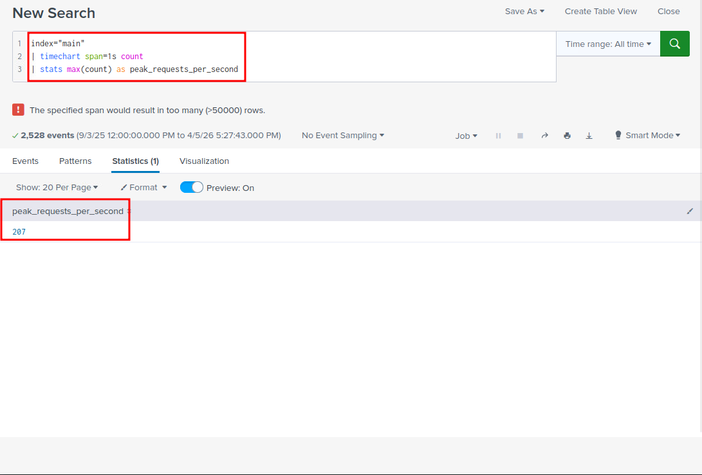

Which legitimate (non-attacking) `clientip` received the first `503` response status post-attack?

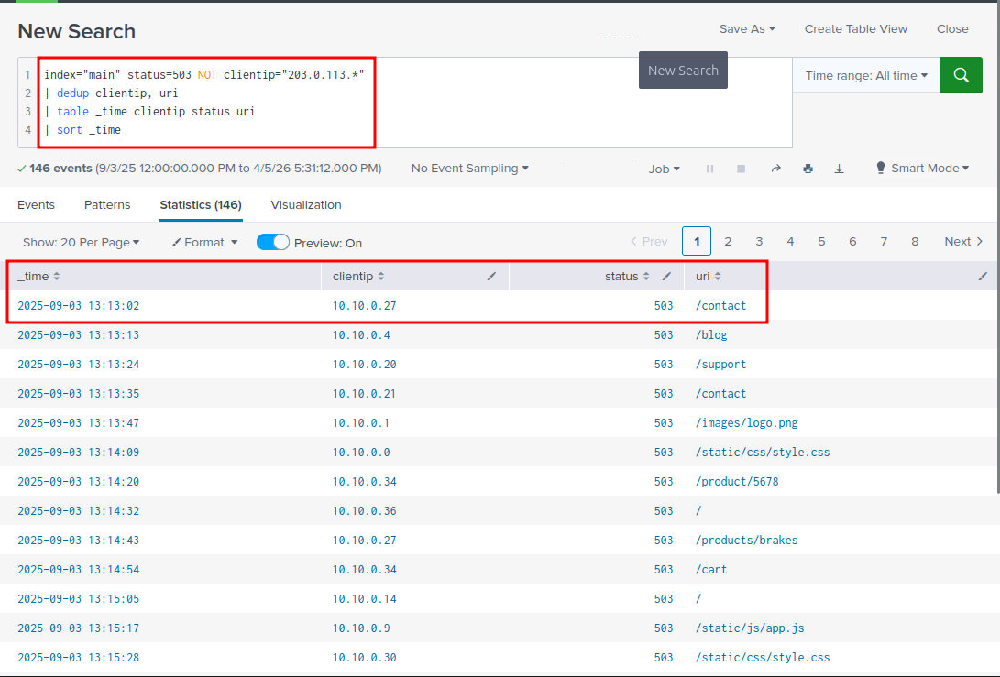

- `status=503`: lọc chỉ các request có mã trạng thái 503.
- `NOT clientip="203.0.113.*"`: loại bỏ các IP thuộc botnet (dựa trên dữ liệu trong bài thực hành).
- `dedup clientip, uri`: loại bỏ các bản ghi trùng lặp theo IP và URI để chỉ giữ lại bản đầu tiên.
- `table _time clientip status uri`: hiển thị thời gian, IP, mã trạng thái và URI.
- `sort _time`: sắp xếp theo thời gian tăng dần để xem bản ghi đầu tiên.

&nbsp;

# Defense

## Application Level Defense

**Secure Development Practices**

- web applications need input validation to stop attackers from submitting specialized queries aimed at overloading the system.

**Challenges**

- This could be a CAPTCHA, where the user solves a puzzle, like clicking images or checking a box. For humans, it’s a small step, but for bots, it can block or slow down an attack.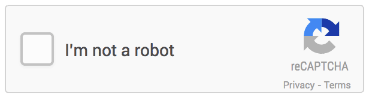
- Websites can also use JavaScript challenges, which run quietly in the background to confirm if a visitor is a real user or automated traffic.

## Network and Infrastructure Defenses

**Content Delivery Network (CDN)**

- CDNs help manage server load by caching and serving content from edge servers closest to users.
- This reduces latency and allows the origin server to handle only a fraction of requests, while the CDN serves the majority
- As a result, CDNs take on much of the burden of mitigating DDoS attacks.
- They also provide load-balancing to distribute traffic across servers, ensuring no single server is overloaded and rerouting requests if one becomes unavailable.

**Web Application Firewall (WAF)**

- CDNs typically integrate WAFs in an effort to shield their customers' servers.
- you might implement a rate-limiting firewall rule that limits requests to `/login.php` to five per minute.If the originating IP requests the page more than five times, it would be blocked from making future requests for a period of time or provided with a challenge to prove it is a human-made request.
- 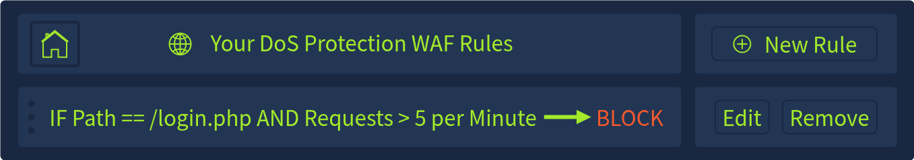