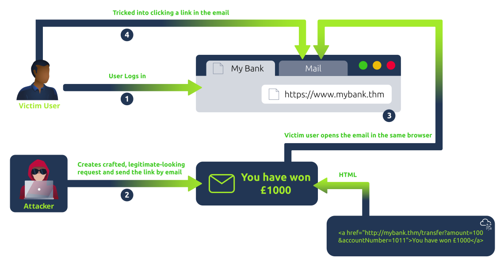
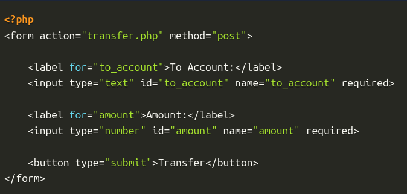
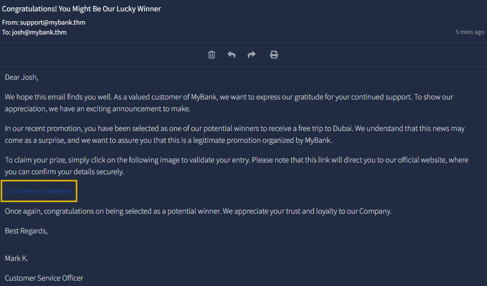
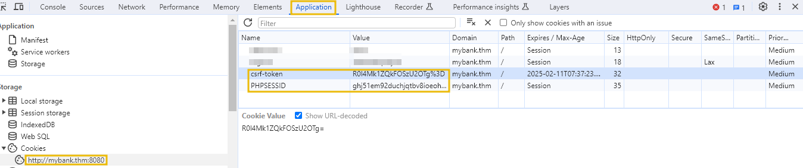
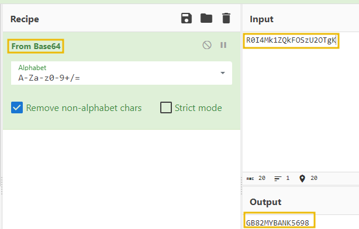
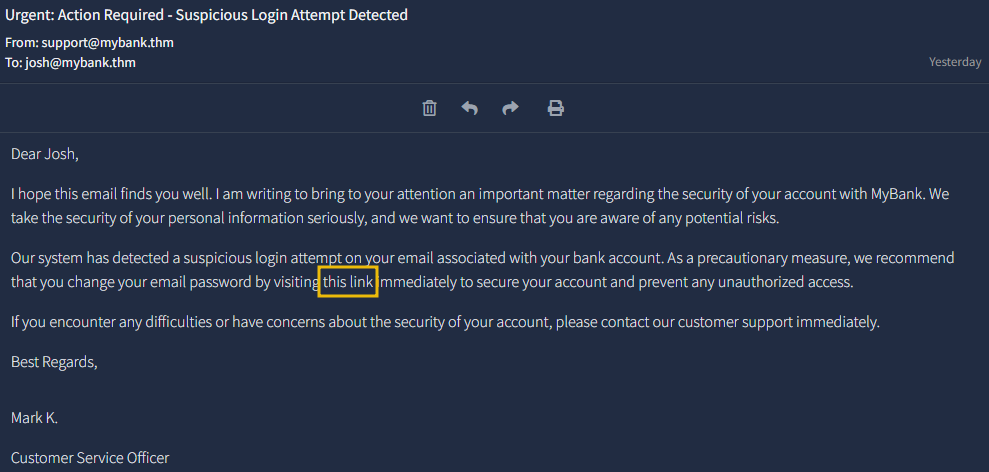

# Overview

**CSRF (Cross-site request forgery)** is a type of security vulnerability where an attacker tricks a user's web browser into performing an unwanted action on a trusted site where the user is authenticated.         

### Bước 1: Attacker sends malicious link (Kẻ tấn công gửi link độc hại)

- Kẻ tấn công (Attacker) không tấn công trực tiếp vào Server. Thay vào đó, chúng nhắm vào **người dùng** đã đăng nhập vào hệ thống (Authenticated User).
    
- Link độc hại này có thể được gửi qua Email, tin nhắn rác hoặc ẩn bên dưới một quảng cáo hấp dẫn trên một trang web khác.
    

### Bước 2: User clicks fraudulent link (Người dùng nhấn vào link giả mạo)

- Nạn nhân (Authenticated User) nhấn vào link đó khi họ **vẫn đang giữ phiên đăng nhập** (còn Cookie) với Server mục tiêu (ví dụ: Facebook, Ngân hàng, hoặc trang quản trị dự án của bạn).
    
- Khi nhấn link, trình duyệt của người dùng sẽ tự động gửi một yêu cầu (Request) tới Server. Vì trình duyệt "ngoan ngoãn", nó tự đính kèm luôn cả **Cookie định danh** của người dùng vào yêu cầu đó.
    

### Bước 3: The server is unaware (Server không hề hay biết)

- Server nhận được yêu cầu và kiểm tra Cookie. Thấy Cookie hợp lệ (đúng là của anh Calvin đang đăng nhập đây rồi!), Server thực thi lệnh ngay lập tức (như đổi mật khẩu, chuyển tiền...).
    
- Server **không thể phân biệt** được yêu cầu đó là do người dùng tự gõ (Authentic) hay do một kịch bản ẩn (Falsified) vừa bị kích hoạt khi người dùng nhấn link.
    

&nbsp;

# Types of CSRF Attack

## Traditional CSRF

frequently concentrate on sate-changing action by submitting forms.



The above diagram shows traditional CSRF examples in the following steps:

- The victim is already logged on to his bank website. The attackers create a crafted malicious link and email it to the victim.
- The victim opens the email in the same browser.
- Once clicked, the malicious link enables the auto-transfer of the amount from the victim's browser to the attacker's bank account.

## XMLHttpRequest CSRF

- This is typical of contemporary online apps that leverage asynchronous server communication (via **XMLHttpRequest** or the **Fetch** API) and JavaScript to produce more dynamic user interfaces.
- These attacks use asynchronous calls instead of the more conventional form submissions.

The following is a simplified overview of the steps that an asynchronous CSRF attack could take:

- The victim opens a session saved in their browser's cookies and logs into the `mailbox.thm`.
    
- The attacker entices the victim to open a malicious webpage with a script that can send queries to the `mailbox.thm`.
    
- To modify the user's email forwarding preferences, the malicious script on the attacker's page makes an AJAX call to `mailbox.thm/api/updateEmail` (using XMLHttpRequest or Fetch).
    
- The `mailbox.thm` session cookie is included with the AJAX request in the victim's browser.
    
- After receiving the AJAX request, mailbox.thm evaluates it and modifies the victim's settings if no CSRF defences exist.
    

# Basic CSRF - Hidden Link/Image Exploitation

## Overview

a convert technique that hacker embeded an 0x0 pixel image or link into a webpage so that nearly undetectable to the user.

Assme that this is the submit form:



so attack can send to user an email with a malicious link to lure the victim to click on the link.



```html
<a href="http://mybank.thm:8080/dashboard.php?to_account=GB82MYBANK5698&amount=1000" target="_blank">Click Here to Redeem</a>
```

### Securing the Breach

```html
<form method="post" action="">
        <label for="password">Password:</label>
        <input type="password" id="password" name="current_password" required>

        <label for="confirm_password">ConfirmPassword:</label>
        <input type="password" id="confirm_password" name="confirm_password" required>
        <input type="hidden" id="csrf_token" name="csrf_token" value="<?php echo $_COOKIE['csrf-token']; ?>">
        <button type="submit" name="password_submit" >Update Password</button>
    </form>submit">
</form>
```

- The bank IT team quickly identified the issue and added a CSRF token with each request submitted to the server. The following code contains the updated client-side code. We can see that there is an additional hidden parameter, `csrf_token`, which will be sent to the server with each request.
- On the server side, the server will verify if each incoming request contains the unique token; otherwise, it will reject the request.

# Double submit Cookie Bypass

## Overview

One effective implementation is the **[Double Submit Cookies technique(opens in new tab)](https://cheatsheetseries.owasp.org/cheatsheets/Cross-Site_Request_Forgery_Prevention_Cheat_Sheet.html#alternative-using-a-double-submit-cookie-pattern)**, where a cookie value corresponds to a value in a hidden form field. When the server receives a request, it checks that the cookie value matches the form field value, providing an additional layer of verification.

## How it works

- **Token Generation**: When a user logs in or initiates a session, the server generates a unique CSRF token. This token is sent to the user's browser both as a **cookie** (CSRF-Token cookie) and embedded in **hidden form fields** of web forms where actions are performed (like money transfers).
- **User Action**: Suppose the user wants to transfer money. They fill out the transfer form on the website, which includes the hidden CSRF token.
- **Form Submission**: Upon submitting the form, two versions of the CSRF token are sent to the server: one in the cookie and the other as part of the form data.
- **Server Validation**: The server then checks if the CSRF token in the cookie matches the one sent in the form data. If they match, the request is considered legitimate and processed; if not, the request is rejected.

### 1\. Session Cookie Hijacking (Tấn công xen giữa - MITM)

- **Giải thích:** Nếu trang web không sử dụng HTTPS hoặc cấu hình Cookie không có cờ `Secure`, kẻ tấn công có thể "nghe lén" đường truyền mạng (ví dụ: dùng Wi-Fi công cộng độc hại).
    
- **Cơ chế:** Hacker bắt được gói tin HTTP và đọc được cả `Session ID` lẫn `CSRF Token` bên trong Cookie. Khi đã có cả hai, chúng có thể tạo ra một yêu cầu giả mạo hoàn hảo mà Server không thể phân biệt được.
    

### 2\. Subverting the SOP (Chiếm quyền Subdomain)

- **Giải thích:** Như mình đã nói, SOP mặc định chặn Domain và Subdomain đọc dữ liệu của nhau. Nhưng nếu hacker chiếm được quyền điều khiển một Subdomain (ví dụ: `blog.hust.edu.vn`), chúng có thể lợi dụng kẽ hở này.
    
- **Cơ chế:** Hacker dùng Subdomain để ghi đè (overwrite) hoặc thiết lập một Cookie mới cho Domain chính (`hust.edu.vn`). Trình duyệt sẽ chấp nhận Cookie này, và khi bạn quay lại trang chính, Server sẽ sử dụng cái "token giả" mà hacker đã cấy vào để kiểm tra.
    

### 3\. Exploiting XSS Vulnerabilities (Khai thác XSS)

- **Giải thích:** **XSS là "khắc tinh" của mọi cơ chế chống CSRF.**
    
- **Cơ chế:** Nếu trang web bị dính XSS, hacker có thể chạy JavaScript ngay trên chính tên miền đó. Đoạn mã này có quyền:
    
    - Đọc giá trị `csrftoken` từ Cookie (nếu không có cờ `HttpOnly`).
        
    - Đọc giá trị token từ các thẻ `<input type="hidden">` trên trang.
        
- **Kết quả:** Một khi đã lấy được token "xịn" qua XSS, việc tạo yêu cầu CSRF trở nên cực kỳ dễ dàng vì hacker đã có đủ mọi "chìa khóa".
    

### 4\. Predicting or Interfering with Token Generation (Dự đoán Token)

- **Giải thích:** Token phải là một chuỗi ngẫu nhiên tuyệt đối (Cryptography Secure).
    
- **Cơ chế:** Nếu lập trình viên dùng các thuật toán yếu (ví dụ: dùng thời gian hệ thống hoặc mã sinh số ngẫu nhiên đơn giản), hacker có thể dùng máy tính để dự đoán xem cái token tiếp theo sẽ là gì.
    
- **Hậu quả:** Nếu đoán được quy luật, hacker không cần lấy trộm mà vẫn có thể tự tạo ra một token hợp lệ.
    

### 5\. Subdomain Cookie Injection (Chèn Cookie từ Subdomain)

- **Giải thích:** Đây là một kỹ thuật tinh vi liên quan đến cách trình duyệt xử lý phạm vi (scope) của Cookie.
    
- **Cơ chế:** Hacker tìm cách "bơm" một Cookie có tên trùng với `csrftoken` từ một subdomain lân cận vào trình duyệt của nạn nhân. Khi nạn nhân thực hiện yêu cầu ở trang chính, trình duyệt có thể gửi kèm cái Cookie "độc hại" này. Nếu hệ thống chỉ kiểm tra xem giá trị trong Cookie có khớp với giá trị trong Form hay không (mà không kiểm tra nguồn gốc tạo ra Cookie đó), lớp phòng thủ sẽ bị sụp đổ.
    

&nbsp;



Suspect that attacker find some cookie on user browser



because of the encode algorithm too easy to guess (just encode by account name). Therefore, attacker can easily fake a submit form with known hidden form field csrf.

**Preparing Payload**

hacker use social engineering to trick the victim change their password.

****

- The email contained a link to an **attacker-controlled domain** (`attacker.mybank.thm`) with a password update form similar to a bank one. The form also has a CSRF token already set as a hidden parameter.

```html
<form method="post" action="http://mybank.thm:8080//changepassword.php" id="autos">
        <label for="password">Password:</label>
        <input type="password" id="password" name="current_password" value="<?php echo "GB82MYBANK5697" ?>" required>

        <label for="confirm_password">ConfirmPassword:</label>
        <input type="password" id="confirm_password" name="confirm_password" value="Attacker Unique Password" required>
        <input type="hidden" id="csrf_token" name="csrf_token" value="Decrypted Token Value">
        

        <button type="submit" name="password_submit"  id="password_submit" >Update Password</button>
    </form>
    
    </div>
<script>
document.getElementById('password_submit').click(); 
</script>
```

```php
<?php
...
setcookie(
    'csrf-token',               
    base64_encode("GB82MYBANK5699"),            
    [
        'expires' => time() + (365 * 24 * 60 * 60), 
        'path' => '/',                         
        'domain' => 'mybank.thm',                          
        'secure' => false,                      
        'httponly' => false,                 
        'samesite' => 'Lax' 
    ]
);
?>
```

let's see what is happening on the server

```php
<?php
if (base64_decode($_POST["csrf_token"]) == base64_decode($_COOKIE['csrf-token'])) { 
// Retrieve form data
$currentPassword = $_POST["current_password"];
$newPassword = $_POST["confirm_password"];
// Update Password
...;
```