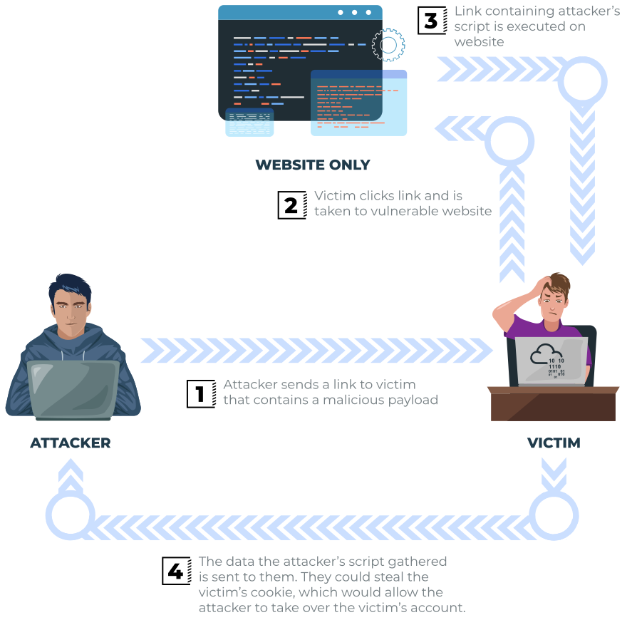
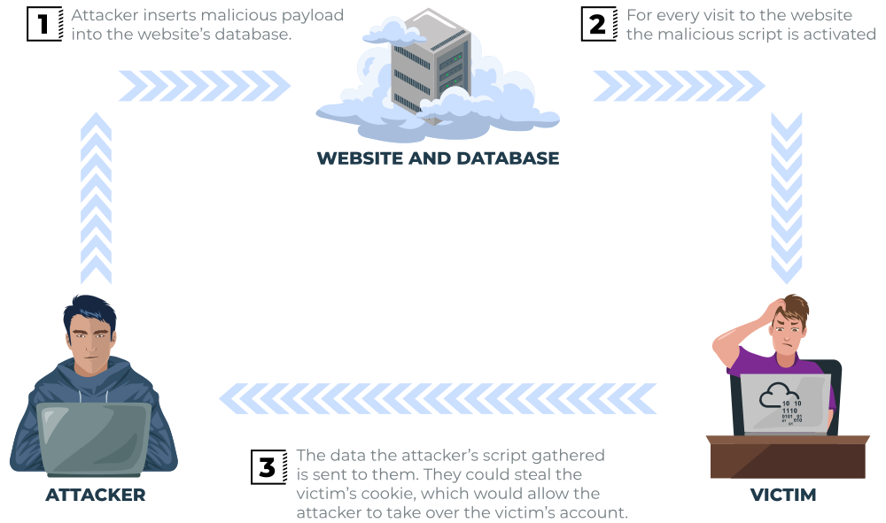
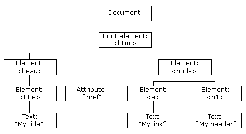

Cross-Site Scripting known as XSS, as an injection attack where malicious JS gets injected into a web application with the intention of being excuted by other users.

# XSS payloads

**payload**: is JS code that we wish to be excuted on target victim.

**Proof Of Concept : ``**

**Session Stealing: ``**

**Key Logger: ``**

# Reflected XSS

Mã độc không nằm trên server mà nằm ngay trong đường dẫn URL.

- **Cách thức:** Kẻ tấn công lợi dụng các trang web hiển thị nội dung trực tiếp từ URL (như trang tìm kiếm, trang báo lỗi).
    
- **Ví dụ:** \* Giả sử trang web có tính năng tìm kiếm: `https://nganhang.com/search?q=điện+thoại`
    
    - Kẻ tấn công gửi cho nạn nhân một đường link đã chỉnh sửa:
        
        `https://nganhang.com/search?q=`
        
    - Khi nạn nhân nhấn vào, trang web sẽ hiển thị thông báo: "Kết quả tìm kiếm cho: ``". Ngay lập tức, trình duyệt thực thi đoạn mã đó.
        
- **Hậu quả:** Chỉ những người nhấn vào link mới bị dính mã độc. Hacker thường dùng kỹ thuật rút gọn link để che giấu đoạn mã script bên trong.
    

# Stored XSS

Đây là hình thức mà mã độc được lưu vĩnh viễn trên máy chủ của trang web.

- **Cách thức:** Kẻ tấn công tìm các nơi mà trang web cho phép người dùng lưu dữ liệu như: phần bình luận, diễn đàn, đổi tên người dùng, hoặc thông tin cá nhân.
    
- **Ví dụ:** \* Trong ô "Bình luận", thay vì nhập "Bài viết hay quá!", kẻ tấn công nhập:
    
    ``
    
    - Nếu website không kiểm tra, chuỗi này sẽ được lưu vào Database (Cơ sở dữ liệu).
- **Hậu quả:** Bất kỳ ai vào đọc bài viết đó, trình duyệt của họ sẽ tải bình luận này lên, hiểu đó là mã JavaScript và thực thi lệnh gửi cookie về máy hacker.
    

# DOM Based XSS (Client-side)

**Exploiting the DOM**

Đây là kiểu chèn mã âm thầm hơn, diễn ra hoàn toàn trong trình duyệt của người dùng mà không cần gửi dữ liệu về server xử lý.

- **Cách thức:** Kẻ tấn công lợi dụng các đoạn mã JavaScript "vô tội" có sẵn trên trang web.
    
- **Ví dụ:** Trang web có một đoạn mã lấy tên người dùng từ URL để chào mừng:
    
    `document.getElementById("welcome").innerHTML = "Chào " + decodeURIComponent(window.location.hash);`
    
    - Kẻ tấn công gửi link: `https://trangweb.com/#`
        
    - JavaScript của trang web sẽ lấy phần sau dấu `#` và chèn nó vào cây DOM. Trình duyệt thấy thẻ `` bị lỗi (vì `src=x`) nên sẽ chạy lệnh `onerror`, từ đó thực thi mã độc.
        

# Blind XSS

### 1\. Kịch bản điển hình (Cách nó hoạt động)

Hãy tưởng tượng bạn đang kiểm thử một trang web bán hàng. Trang web này rất bảo mật ở phần bình luận, nhưng phần **"Gửi khiếu nại cho quản trị viên"** hoặc **"Chat với hỗ trợ viên"** thì lại lỏng lẻo.

1.  **Chèn mã (Injection):** Kẻ tấn công gửi một yêu cầu hỗ trợ với nội dung: `Chào hỗ trợ viên, đơn hàng của tôi bị lỗi: `
    
2.  **Lưu trữ (Storage):** Hệ thống lưu tin nhắn này vào cơ sở dữ liệu. Ở phía giao diện người dùng, kẻ tấn công chỉ thấy thông báo: *"Cảm ơn, chúng tôi đã nhận được tin nhắn"*. Họ không thấy mã JS chạy, nên gọi là "mù".
    
3.  **Kích hoạt (Execution):** Vài tiếng sau, một **Quản trị viên (Admin)** đăng nhập vào trang quản trị nội bộ (`admin.trangweb.com/dashboard`) để xem danh sách khiếu nại.
    
4.  **Hậu quả:** Khi Admin mở tin nhắn đó, trình duyệt của Admin sẽ tải và thực thi file `logger.js` từ máy chủ của hacker.
    

* * *

### 2\. Tại sao Blind XSS lại cực kỳ nguy hiểm?

- **Nhắm vào mục tiêu cao cấp:** Nạn nhân thường là Admin, nhân viên kỹ thuật hoặc người có quyền hạn cao trong hệ thống.
    
- **Đánh cắp thông tin nội bộ:** Kẻ tấn công có thể lấy được Cookie của Admin, chụp ảnh màn hình trang quản trị (Dashboard), hoặc thậm chí sửa đổi dữ liệu hệ thống mà người dùng bình thường không bao giờ chạm tới được.
    
- **Khó phát hiện:** Vì mã độc chỉ chạy trong các trang quản trị nội bộ (Back-end), các công cụ quét bảo mật thông thường quét ở phía người dùng (Front-end) thường sẽ bỏ sót.
    

* * *

### 3\. Cách kẻ tấn công "nhìn thấy" kết quả

Vì kẻ tấn công bị "mù" (không thấy trang admin), họ sử dụng các kỹ thuật **Out-of-band (OOB)** để nhận dữ liệu:

- **XSS Hunter:** Một công cụ phổ biến. Kẻ tấn công chèn một đường link dẫn đến máy chủ XSS Hunter. Khi mã độc chạy trong trình duyệt của Admin, XSS Hunter sẽ tự động thu thập:
    
    - Địa chỉ URL của trang quản trị (thứ mà hacker thường không biết).
        
    - Địa chỉ IP của Admin.
        
    - Toàn bộ nội dung trang (DOM).
        
    - Cookie và ảnh chụp màn hình.
        
- Sau đó, công cụ này sẽ gửi email thông báo cho hacker: *"Này, con mồi đã dính bẫy tại trang admin!"*.
    

### Tóm tắt cơ chế chèn mã

| **Đặc điểm** | **Stored XSS** | **Reflected XSS** | **DOM-based XSS** |
| --- | --- | --- | --- |
| **Nơi chứa mã** | Database của Server | Trong URL | Trong URL/Bộ nhớ trình duyệt |
| **Đối tượng bị hại** | Tất cả mọi người xem trang | Người nhấn vào link lừa đảo | Người nhấn vào link lừa đảo |
| **Ví dụ điển hình** | Bình luận, Profile | Ô tìm kiếm, Thông báo lỗi | Chỉnh sửa giao diện bằng JS |