# A. Task Manager

- 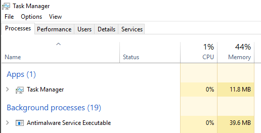

&nbsp;       is a built-in GUI based Windows utility in which allows user to see general information about the system.

# B. System

- The first windows process gonna be run.
- `System's PID will always be 4.`
- runs only in kernel mode (kernel-mode system thread).
- executing code loaded in system space.

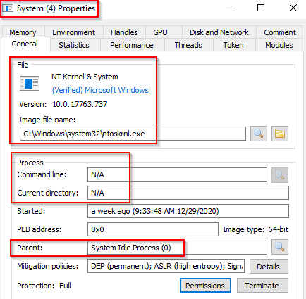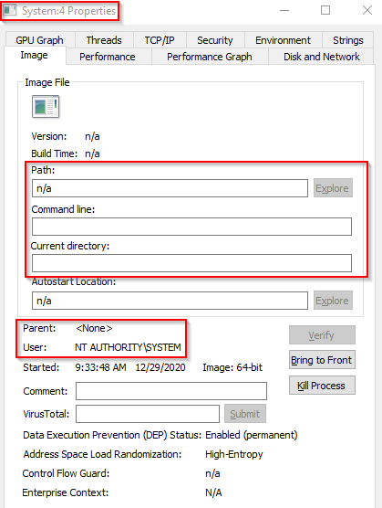

| Path: N/A     **Parent Process**: None    **Number of Instances**: One    **User Account**: Local System    **Start Time**: At boot time | **Image Path**: C:\\Windows\\system32\\ntoskrnl.exe (NT OS Kernel)    **Parent Process**: System Idle Process (0) |
| --- | --- |

# C. System > smss.exe

**smss.exe (Session Manager Subsystem == Windows Session Manager)**

- responsible for creating new sessions.
- includes win32k.sys (kernel mode), winsrv.dll (user mode), csrss.exe (user mode)
- first user-mode started by the kernel.
- starts csrss.exe (Windows subsystem) & wininit.exe in session 0 
    - csrss.exe & winlogon.exe for session 1 (User session) .
- the first child instance creates child instances in new sessions by copying itself and self-terminating.
- responsible for creating environment variables, virtual memory paging files and starts winlogon.exe.

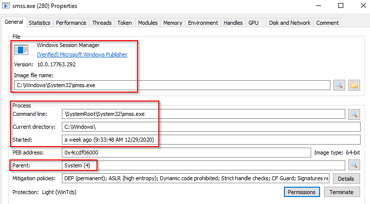

**Path**: %SystemRoot%\\System32\\smss.exe

**Parent Process**: System

**Number of Instances**: One master instance and child instance per session. The child instance exits after creating the session.

**User Account**: Local System

**Start Time**: `Within seconds of boot time` for the master instance

# D. csrss.exe

**csrss.exe (Client Server Runtime Process)**

- user-mode side of the windows subsystem.
- is always running and critical to system operation. If this process is terminated by chance --> system failure.
- responsible for the Win32 sybsystem,  lifecycle processing, thread management (create/delete).
- making API available to other processes, mapping drive letters, handling Windows shutdown process.
- created by instace of smss.exe

&nbsp;                                       **Session 0 (PID 392)**

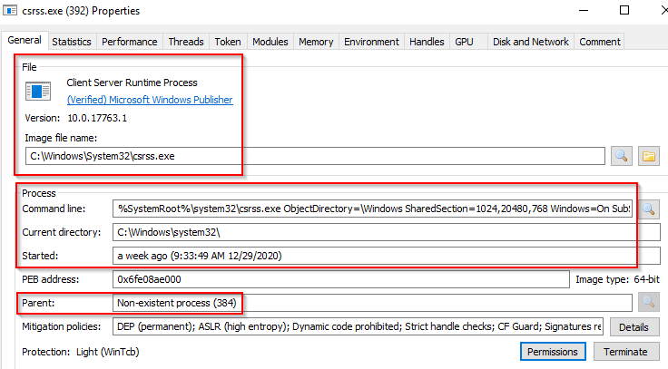

&nbsp;                                               **Session 1 (PID 512)**

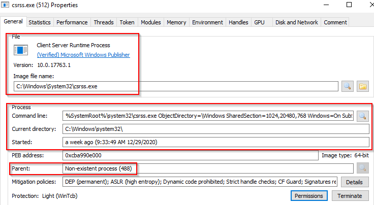

&nbsp;Path: %SystemRoot%\\System32\\csrss.exe

**Parent Process**: Created by an instance of smss.exe

**Number of Instances**: Two or more

**User Account**: Local System

**Start Time**: Within seconds of boot time for the first two instances (for Session 0 and 1). Start times for additional instances occur as new sessions are created, although only Sessions 0 and 1 are often created.

# E. wininit.exe

**wininit.exe (windows initialization process)**

responsible for launching (within session 0) :

- services.exe (Service Control Manager)
- lsass.exe (Local Security Authority)
- lsaiso.exe (associated with Credential Guard and KeyGuard)

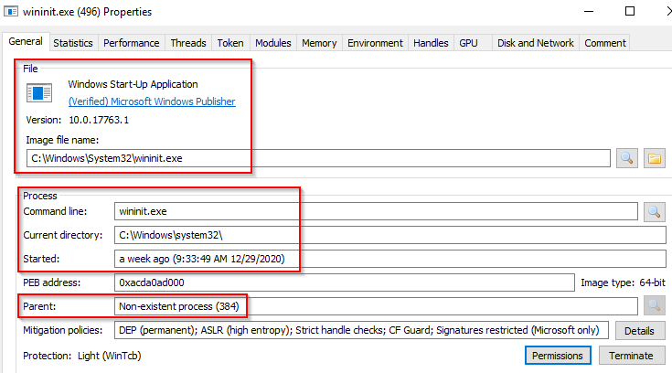

**Image Path**: %SystemRoot%\\System32\\wininit.exe

**Parent Process**: Created by an instance of smss.exe

**Number of Instances**: One

**User Account**: Local System

**Start Time**: Within seconds of boot time

# F. wininit.exe > services.exe

services.exe (Service Control Manager - SCM)

- responsible for handle system services.
- information regarding services is stored in the registry, `HKLM\System\CurrentControlSet\Services`
- 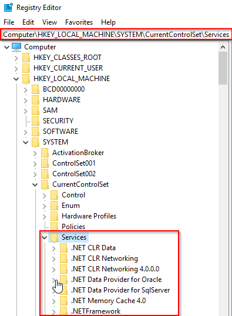
- is the parent of svchost.exe, spoolsv.exe, msmpeng.exe, dllhost.exe.

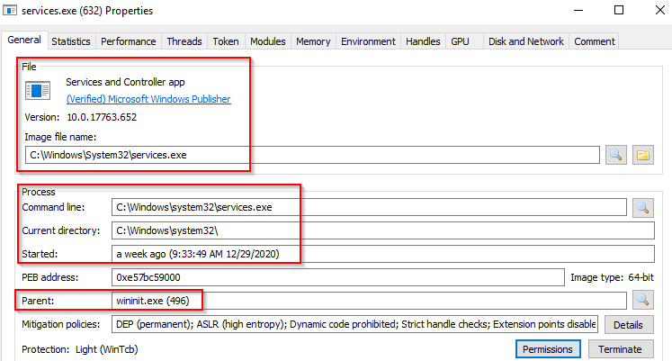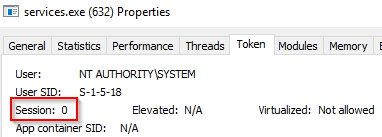

**Image Path**: %SystemRoot%\\System32\\services.exe

**Parent Process**: wininit.exe

**Number of Instances**: One

**User Account**: Local System

**Start Time**: Within seconds of boot time

# G. wininit.exe > service.exe > svchost.exe

**svchost.exe (Service Host - Host process for Windows Services) : responsible for hosting and managing Windows Services.**

the services running in this process are implemented as DLLs, which is stored in the registry

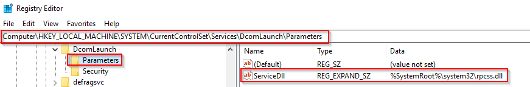

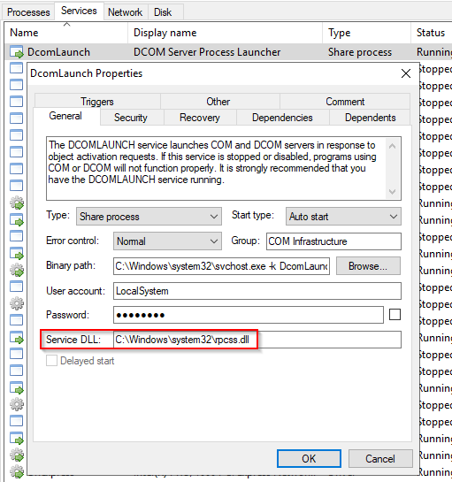

- the -k parameter in binary path is grouping similar services to share the same process to reduce resource consumption.
- usually has been a target for malicious activities because svchost.exe have to handle many running process.

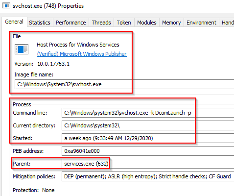

**Image Path**: %SystemRoot%\\System32\\svchost.exe

**Parent Process**: services.exe

**Number of Instances**: Many

**User Account**: Varies (SYSTEM, Network Service, Local Service) depending on the svchost.exe instance. In Windows 10, some instances run as the logged-in user.

**Start Time**: Typically within seconds of boot time. Other instances of svchost.exe can be started after boot.

# H. lsass.exe

**lsass.exe (Local Security Authority Subsystem Service)**

- a process in Microsoft Windows OS responsible for enforcing security policy on the system.
- verifies users logging on / passwords changes / created access tokens.
- writes to Windows Security Log.
- creates security tokens for SAM (Security Account Manager) , AD (Active Directory).
- uses authentication packets specified in `HKLM\System\CurrentControlSet\Control\Lsa`
- usually targeted by adversaries ( by tools such as mimikatz)

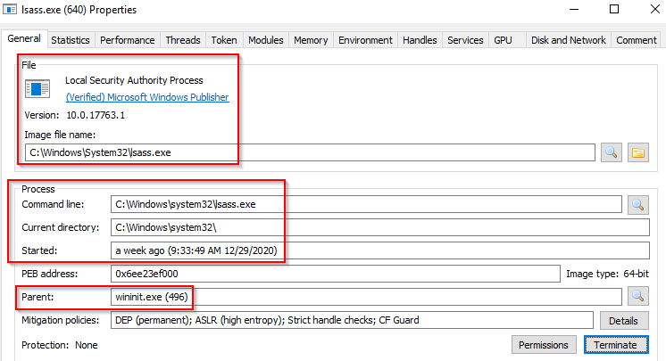

**Image Path**: %SystemRoot%\\System32\\lsass.exe

**Parent Process**: wininit.exe

**Number of Instances**: One

**User Account**: Local System

**Start Time**: Within seconds of boot time

# I. winlogon.exe

- handling the Secure Attention Sequence (SAS) ensure that user's login information is passed in legitimate place (by ALT + CTRL + DELETE).
- responsible for locking screen (windows + L) and running user's screensaver.
- created by instance of smss.exe

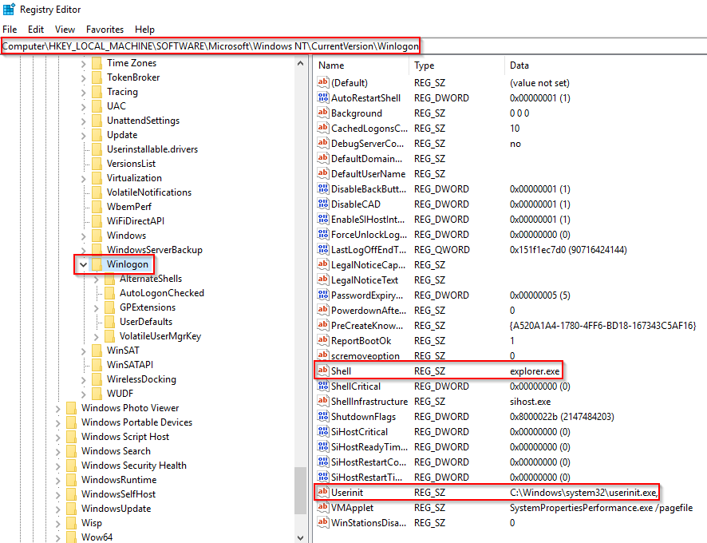

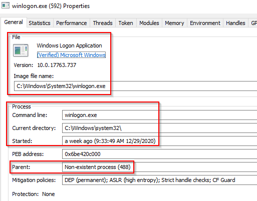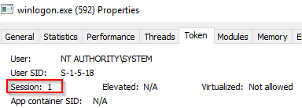

**Image Path**: %SystemRoot%\\System32\\winlogon.exe

**Parent Process**: Created by an instance of smss.exe that exits, so analysis tools usually do not provide the parent process name.

**Number of Instances**: One or more

**User Account**: Local System

**Start Time**: Within seconds of boot time for the first instance (for Session 1). Additional instances occur as new sessions are created, typically through Remote Desktop or Fast User Switching logons.

# K. explorer.exe

(Windows Explorer)

gives the user access to their folders and files.

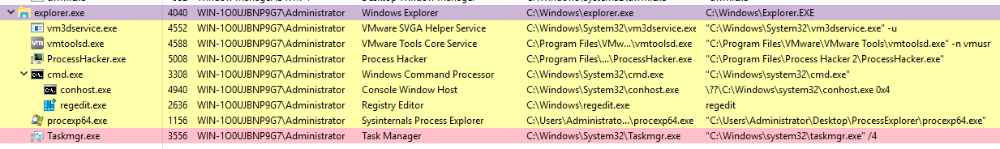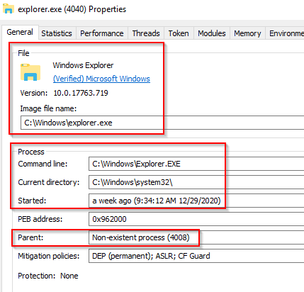

**Image Path**: %SystemRoot%\\explorer.exe

**Parent Process**: Created by userinit.exe and exits

**Number of Instances**: One or more per interactively logged-in user

**User Account**: Logged-in user(s)

**Start Tim**e: First instance when the first interactive user logon session begins