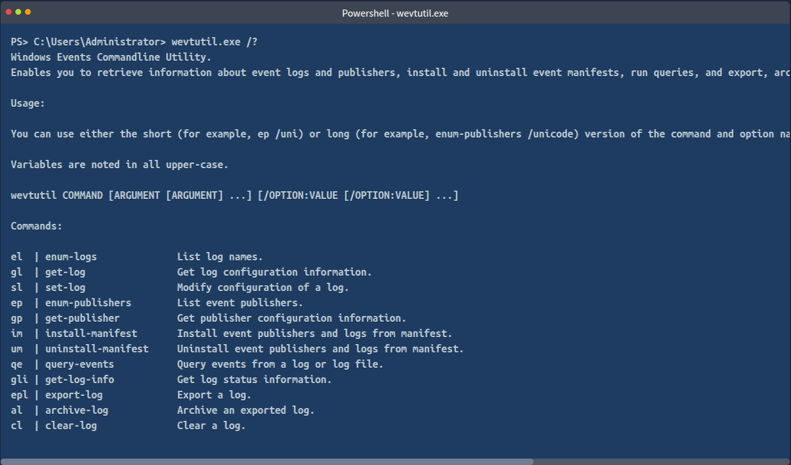
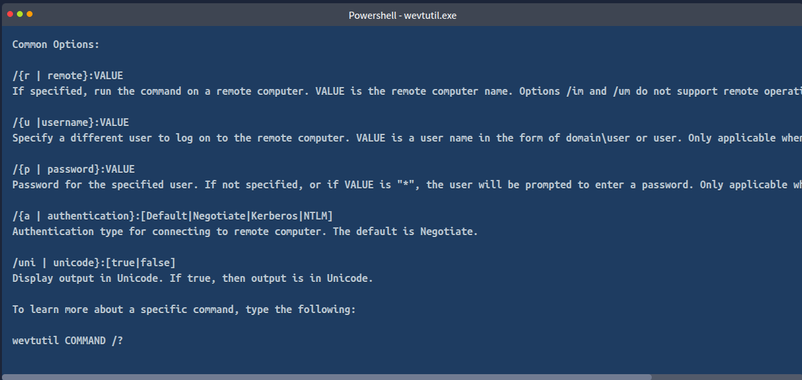
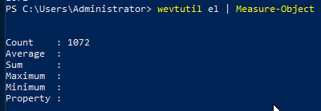

# **wevtutil.exe (Windows Event Utility)**

enable to retrieve information about event logs and publishers.

use these commands to install / uninstall event manifest, run queries, export/archive/clear logs.

common options that can be used with Windows Events Utility

**Practice**

**1\. How many log names are in the machine?**

- `wevtutil el` : list out all of name of logs.
- `Measure-Object`: count number of lines.
- \== `(wevtutil el).Count`
- 

**2\. What event files would be read when using the query-events command?**

- event log, log file, structured query

**3\. what option would you use to provide a path to a log file?**

- **/lf:true**

&nbsp;

&nbsp;