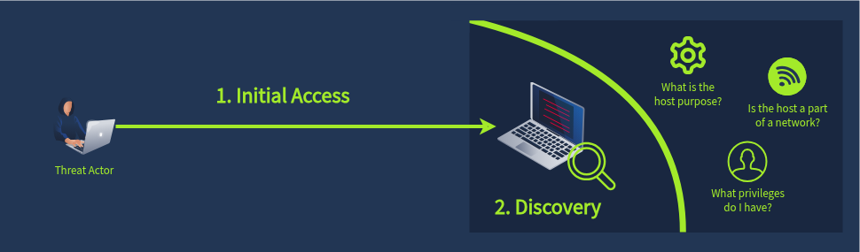
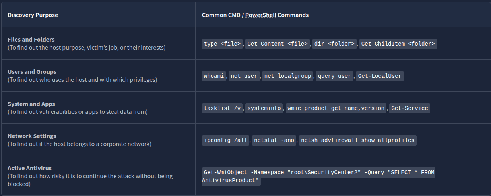
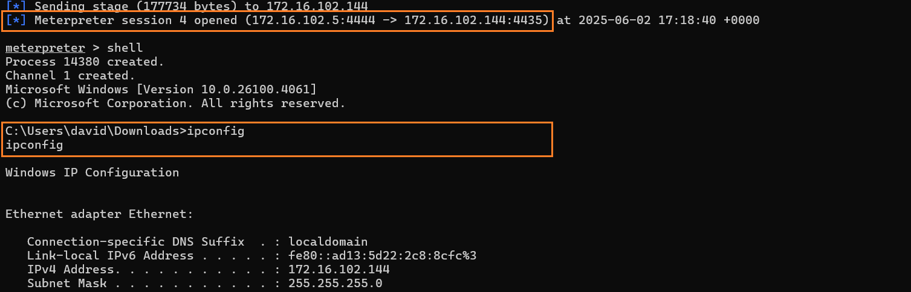
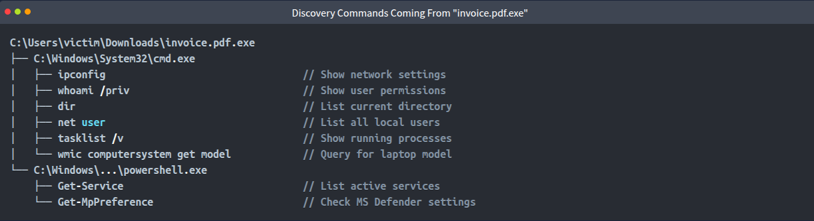
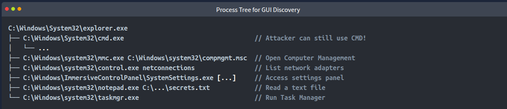
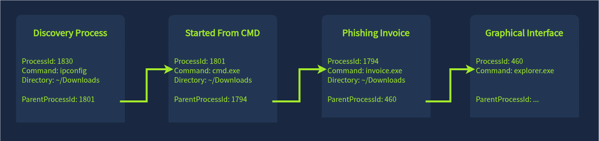
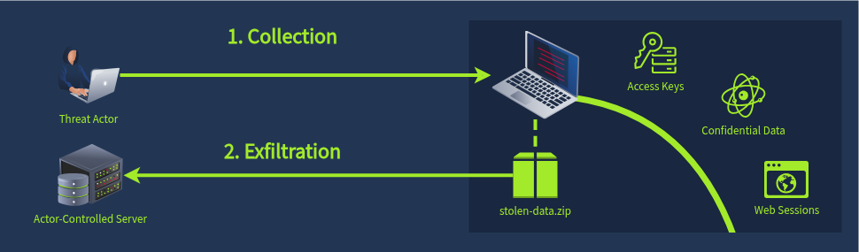
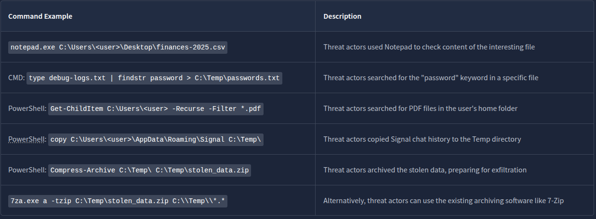
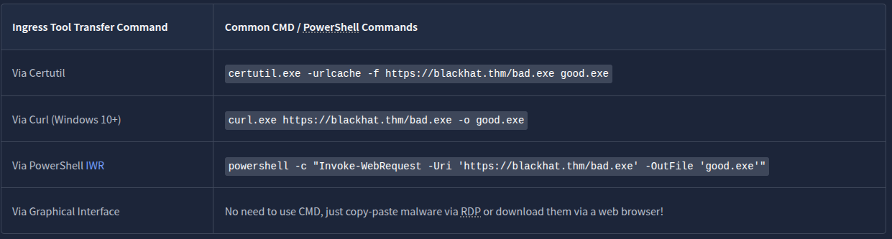
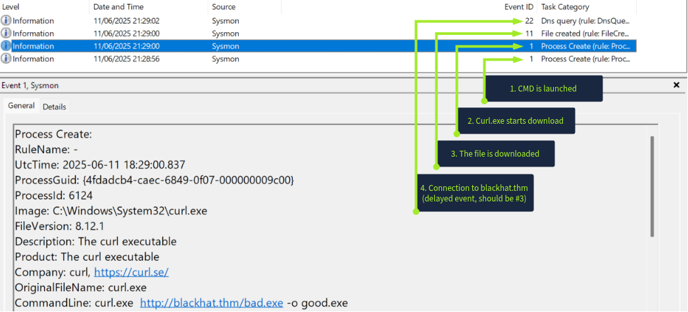

# Discovery Overview

# Discovery Commands

# Discovery Process

**How attacker control the victim**

# Detecting Discovery

**Discovery via CMD**

**Discovery via GUI**

- using RDB protocol
- 

## Process Tree

# Collection Overview

## Searching Secrets

## Collection target

the most of the sensitive data can be stored in simple files and also hidden in the registry or in process memory such as:

- Exfiltrate stolen data to DropBox, Mega, Amazon S3, or other trusted cloud storage services ([Examples](https://attack.mitre.org/techniques/T1567/002/#:~:text=Procedure%20Examples))
- Exfiltrate stolen data to known code repositories like GitHub or messengers like Telegram ([Example](https://cyberint.com/blog/research/the-new-infostealer-in-town-the-continental-stealer/#:~:text=offers%20a%20Telegram%20bot%20notification%20feature%20that%20informs%20users))
- Or just create a trustworthy-looking domain like "windows-updates.com" and send the data there

# Detecting Collection

# Ingress Tool Transfer

threat actors may need to download more tools to achieve their goals, for example:

- A script to automate Discovery and find common vulnerabilities like [Seatbelt](https://github.com/GhostPack/Seatbelt)
- A tool to extract saved passwords or OS credentials like [Mimikatz](https://github.com/gentilkiwi/mimikatz)
- A fully functional Remote Access Trojan (RAT) like [Remcos RAT](https://www.checkpoint.com/cyber-hub/threat-prevention/what-is-malware/remcos-malware/)
- Finally, a ransomware binary to encrypt the system after the data is stolen

## Common Transfer Methods

## Complete event chain

&nbsp;