# <span style="color: rgb(241, 196, 15);">Attack without C2</span>

C2 is not needed at all.

For example:

- attacker can type their commands directly in the RDP session, but it gonna be unavailable as soon as RDP is closed or secured.
- So, most threat actors choose to still set up a C2 immediately after the breach.
- 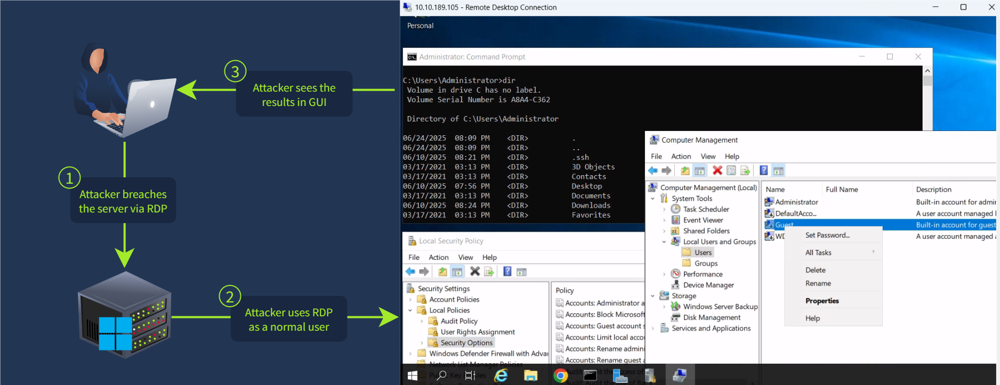

&nbsp;

# <span style="color: rgb(241, 196, 15);">Simplest C2</span>

- the phishing attachment will establish the C2 channel (like <span style="color: rgb(241, 196, 15);">CobaltStrick2</span>).
- In more advanced cases, the attachment won't immidiately connect back, but rather download an additional C2 malware, hide it in a folder like C:\\Temp, and run it in stealthy process. This benificial to keep the attack remaining if the victim delete the original attachment.
- 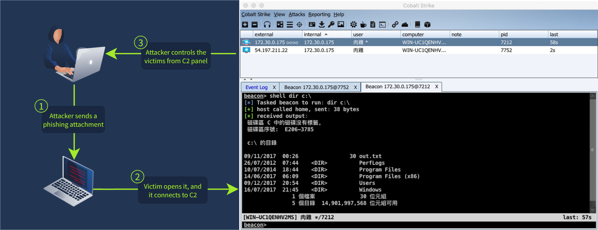

# <span style="color: rgb(241, 196, 15);">Persistence Overview</span>

- 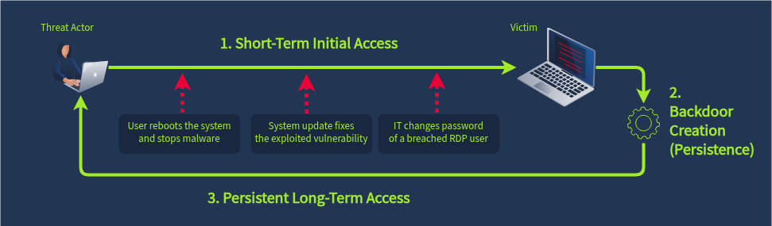
- Pesistence is a tactic of maintaining reliable, long-term access to the target that survive reboot and password changes.

## Persisting via RDP

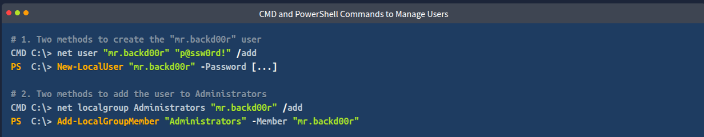

- Create an additional hidden vulnerability in the breached service (e.g. a backdoor or a [web shell](https://attack.mitre.org/techniques/T1505/003/))
- Create a new user ([T1136](https://attack.mitre.org/techniques/T1136/)), make it an administrator ([T1098](https://attack.mitre.org/techniques/T1098/007/)), and use it for further RDP logins

## Detecting Backdoored Users

- go back to the Security event logs (user creation: ID=4720). 
- investigating process:

1.  1.  **Who** created the account? Can the person confirm the account creation?
    2.  **What** is the source IP and time of the creator's login? Is it expected?
    3.  **Which** other suspicious events can you see in the creator's session?

###  Making users Privileged

- default user won't take much high permission, so attacker gonne create an backdoor account and add into one of the privileged groups - which could be tracked by <span style="color: rgb(241, 196, 15);">Security event ID 4732</span>.

### Resetting Passwords

- threat actors may simply reset the password of an old / unused account to use it instead of creating a new one.
- we can detect it in <span style="color: rgb(241, 196, 15);">Security event logs with ID 4724.</span>

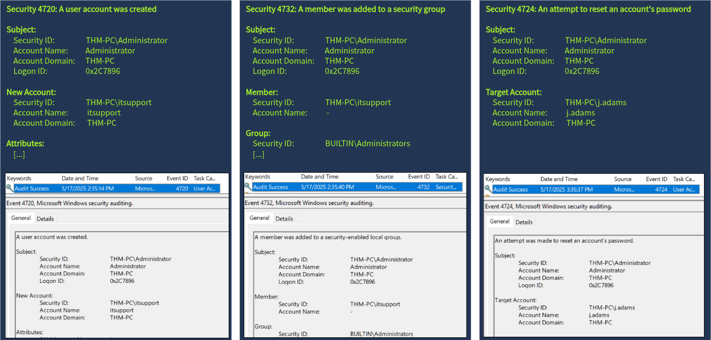

# <span style="color: rgb(241, 196, 15);">Persistence: Tasks and Service</span>

## <span style="color: rgb(255, 255, 255);">Malware Persistence</span>

- <span style="color: rgb(255, 255, 255);">persistence via backdoored user works well if you can remotely log in to it via RDP, but if the attack started by phishing or USB infection, thats not an option.</span>
- <span style="color: rgb(255, 255, 255);">threat actors need to actively run malware that maintains a connection with their C2 server even after reboot or change password.</span>

## <span style="color: rgb(255, 255, 255);">Services and Tasks</span>

- <span style="color: rgb(255, 255, 255);">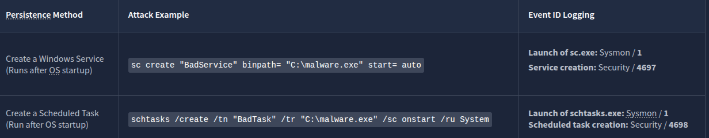</span>

## Detecting Services

detecting malicious services in three way in logs:

1.  Detect the launch of the `sc.exe create` command via <span style="color: rgb(241, 196, 15);">Sysmon event ID **1**</span>
2.  Detect service creation via <span style="color: rgb(241, 196, 15);">Security event ID **4697**</span> or <span style="color: rgb(241, 196, 15);">System event ID [7045](https://www.manageengine.com/products/active-directory-audit/kb/system-events/event-id-7045.html)</span>
3.  Detect suspicious processes with a `services.exe` parent process

- 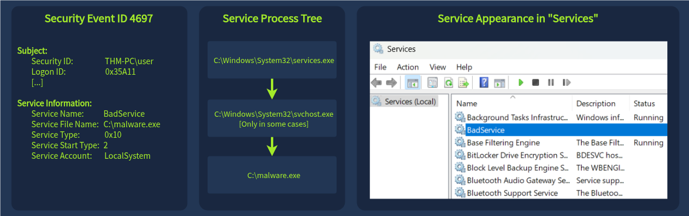

## Detecting Tasks

- view services by lauching <span style="color: rgb(241, 196, 15);">taskschd.msc</span> or searching "<span style="color: rgb(241, 196, 15);">Task Scheduler</span>" or "<span style="color: rgb(241, 196, 15);">schtasks.exe</span>" commandline.
- detect scheduled tasks in 3 ways:
    1.  Detect the launch of the `schtasks.exe /create` command via <span style="color: rgb(241, 196, 15);">Sysmon event ID **1**</span>
    2.  Detect and analyze scheduled task creation events via <span style="color: rgb(241, 196, 15);">Security event ID **4698**</span>
    3.  Detect suspicious processes with a `svchost.exe [...] -s Schedule` parent

&nbsp;

# <span style="color: rgb(241, 196, 15);">Persistence: Run keys and Startup</span>

## Run Key and Startup

Services and scheduled tasks are typically run on system boot and require administrative privileges to configure.

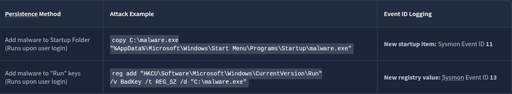

## Detecting Startup

**startup folder:**

- easy way for inexperienced users to configure programs to run on login.
    
- automatically start when users login.
    
- it's not ideal with legitimate programs so it is usally empty. Therefore, threat actors could place some malwares here.
    
- C:\\Users\\&lt;USER&gt;\\AppData\\Roaming\\Microsoft\\Windows\\Start Menu\\Programs\\Startup\\  
    Or for all users: C:\\ProgramData\\Microsoft\\Windows\\Start Menu\\Programs\\StartUp
    
    ```
    C:\Users\<USER>\AppData\Roaming\Microsoft\Windows\Start Menu\Programs\Startup\
    Or for all users: C:\ProgramData\Microsoft\Windows\Start Menu\Programs\StartUp
    ```
    
    .
    
- file creatation events (<span style="color: rgb(241, 196, 15);">Sysmon Event ID 11</span>) inside Startup folder.
    
- 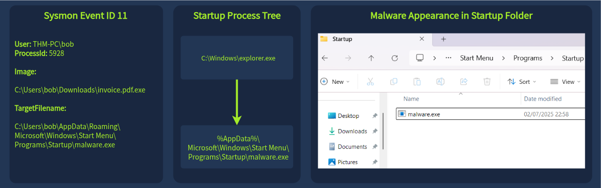

## Detecting Run Keys

- Run key persistence is very similar to the startup folder.
    
- Diffirence: instead of copying the program to the startup folder, create a new value in the "Run" Windows registry and put the path to the program.
    
- ```plaintext
          HKEY_CURRENT_USER\Software\Microsoft\Windows\CurrentVersion\Run
          Or for all users: HKEY_LOCAL_MACHINE\Software\Microsoft\Windows\CurrentVersion\Run
    ```
    
- to view "Run" entries, launch the <span style="color: rgb(241, 196, 15);">`regedit.exe`</span> or seach for "<span style="color: rgb(241, 196, 15);">Registry Editor</span>"
    
- monitor the registry change events (Sysmon Event ID 13) affecting the Run keys
    
- 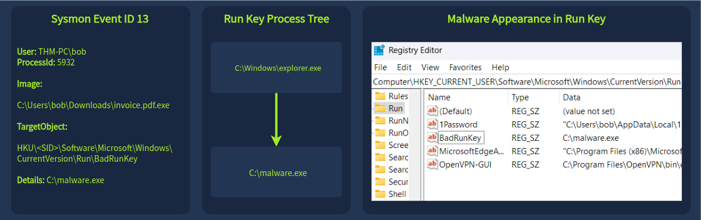

# <span style="color: rgb(241, 196, 15);">Impact and Threat Detection Recap</span>

## Need for Persistence

1.  **Add the host to a botnet and use it for further attacks**
    - Like how the Kraken Botnet [combines](https://www.zerofox.com/intelligence/meet-kraken-a-new-golang-botnet-in-development/#details) crypto miner, data stealer, and C2 capabilities
2.  **Spy on the victim as a part of a state-sponsored campaign**
    - Like how Volt Typhoon [stayed undetected](https://www.itpro.com/security/cyber-attacks/volt-typhoon-threat-group-electric-grid) in the US electric grid for nearly a year
3.  **Use the victim as an entry point to the network, breaching which could take months**
    - Like in [the case](https://thedfirreport.com/2024/04/29/from-icedid-to-dagon-locker-ransomware-in-29-days/#timeline) where threat actors spent 29 days breaching a full network

- 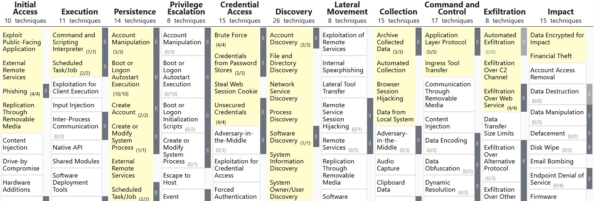

&nbsp;